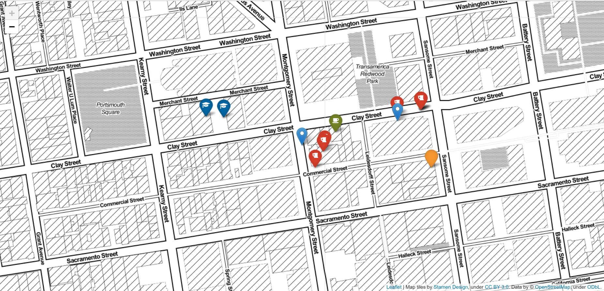

# Localizador de Oficinas
## Introducción
El objetivo de este proyecto es el de buscar la mejor localización para establecer una oficina, a partir de una series de requerimientos y condicionantes, escogidas por el propio usuario. 

## Materiales y métodos
Como base de datos de partida, en este proyecto se ha usado Crunchbase, una extensa base de datos de compañías de EEUU. El primer paso fue extraer la información espacial asociada a cada compañía (en el caso de que ésta estuviera dispobnible) y su preparación para realizar consultas espaciales a través de mongodb, mediante la adición de un índice espacial.
En paralelo, y para extraer locacalizaciones de puntos de interés requeridos en las condiciones iniciales, se ha usado la API Places de Foursquare. Para optimizar la búsqueda de puntos de interés y su procesado de cara a su utilización en la base de datos, se han creado las siguientes funciones recogidas en el archivo **foursquare_queries.py**:
- `foursquare2jdf`: Hace la request a través de la API, del json resultante extrae nombre y coordenadas de cada elemento encontrado.
- `column2geo`: Función intermedia que sirve para convertir a formato geoJson cada fila del dataframe anterior
- `df2geo`: Función que transforma el dataframe recibido a formato geoJson y lo guarda como un fichero .json.

A continuación, se ejecutan estas funciones para extraer y almacenar los datos de los puntos de interés, en este caso: Starbucks, restaurantes veganos, lugares de fiesta y escuelas. Esta parte del proceso se encuentra recogida en el archivo **foursquare_imports.py**. Una vez generados los archivos, se importan a la base de datos mediante el comando mongoimport.

Por último, se procede a la realización de las consultas a través de pymongo para determinar las mejores ubicaciones para las oficinas. Las funciones desarrolladas para automatizar este proceso se encuentran en el archivo **query_functions.py**. Para comprender mejor la lógica de la búsqueda, se recomienda leer el archivo **MainJupyter.ipynb**.

## Resultados
Los resultados son, por un lado, una tabla que recoge las localizaciones de las oficinas analizadas y el número de puntos de interés establecidos como condicionates que caen dentro de las distancias fijadas. Por otro, se presenta un mapa con la localización de las dos oficinas candidatas junto con los punto de interés cercanos.

